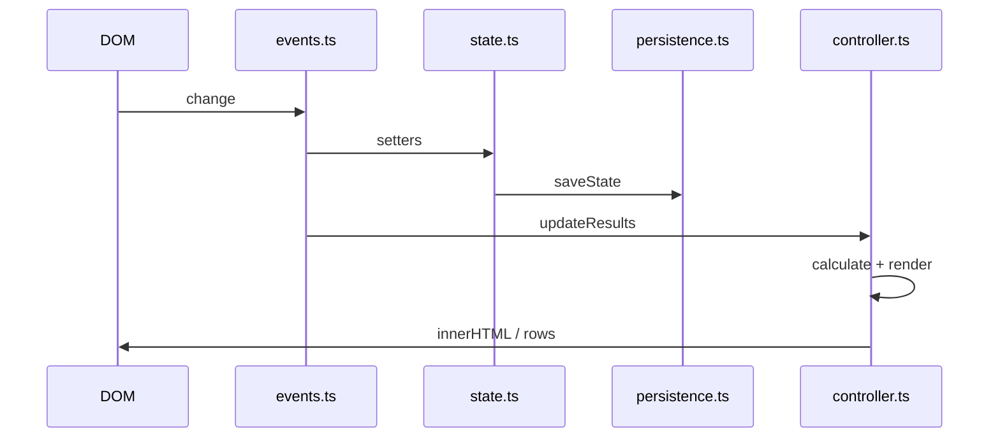

# Architecture

[← Technical hub](technical.md)

## Layout

- **[`assets/js/main.ts`](../assets/js/main.ts)** — `DOMContentLoaded`: `initState()`, grab elements, `renderResourceOptions`, `bindEvents`, `updateResults`
- **[`assets/js/app/state.ts`](../assets/js/app/state.ts)** — in-memory `AppState`; setters call `persist()` after mutations
- **[`assets/js/app/persistence.ts`](../assets/js/app/persistence.ts)** — `localStorage` read/write, JSON envelope, migrations, `parsePersistedEnvelope` for import
- **[`assets/js/ui/events.ts`](../assets/js/ui/events.ts)** — input handlers; state setters; `updateResults` and related UI sync
- **[`assets/js/ui/controller.ts`](../assets/js/ui/controller.ts)** — `updateResults`, resource search UI, preset dropdown rendering
- **[`assets/js/ui/productionView.ts`](../assets/js/ui/productionView.ts)** — which resources appear under “Your production”
- **[`assets/js/calculator/`](../assets/js/calculator/)** — `calculate` → `resolve`; `calculateNet` for surplus/deficit
- **[`assets/js/formatters/`](../assets/js/formatters/)** — flat totals, tree flattening, labels/units for tables

## Request and render path

User interaction updates **state** (which persists), then **`updateResults`** in [`controller.ts`](../assets/js/ui/controller.ts) reads `getResourceId`, `getTargetRate`, `getProduction` and drives the three results panels plus the production panel.

## Persistence events

`state.ts` dispatches a custom event on `window` after successful saves so the toolbar (for example **Reset** disabled state) can stay in sync—see `syncResetSavedDataButtonDisabled` in [`events.ts`](../assets/js/ui/events.ts).

## Related

- [Calculator](technical-calculator.md) — how `updateResults` uses `calculate`
- [State and persistence](technical-state-and-persistence.md) — envelope shape and migrations
