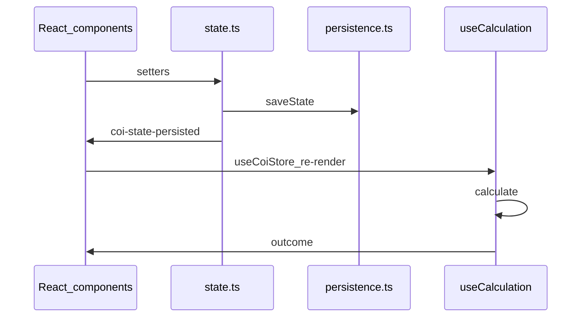

# Architecture

[← Technical hub](technical.md)

## Layout

- **[`src/main.tsx`](../src/main.tsx)** — Entry: `initGoogleAnalytics`, `initCoiApp` (loads persisted state), `createRoot` → **`App`**
- **[`src/App.tsx`](../src/App.tsx)** — Chooses **home** / **calculator** / **canvas** view; **`useCoiStore`** + **`useCalculation`** for the calculator page; renders **`UserGuide`**, **`HomeView`**, calculator layout (**`RecentResources`**, **`TargetResourcePanel`**, **`ProductionSection`**, **`PresetsSection`**, **`ResultsSection`**, **`NetFlowChartSection`**, **`Footer`**), or **`CanvasView`**
- **[`src/hooks/useCalculation.ts`](../src/hooks/useCalculation.ts)** — Memoized **`calculate(...)`** from [`service.ts`](../assets/js/calculator/service.ts) using current **`AppState`** (resource, rate, recipe index, base-requirements mode)
- **[`assets/js/app/coiExternalStore.ts`](../assets/js/app/coiExternalStore.ts)** — **`useSyncExternalStore`** bridge so React reads the imperative **`AppState`** snapshot from [`state.ts`](../assets/js/app/state.ts); subscribes to **`coi-state-persisted`**, **`COI_PERSISTED_CHROME_EVENT`**, and **`storage`**
- **[`assets/js/app/state.ts`](../assets/js/app/state.ts)** — In-memory **`AppState`**; setters call **`persist()`** after mutations
- **[`assets/js/app/persistence.ts`](../assets/js/app/persistence.ts)** — `localStorage` read/write, JSON envelope, migrations, **`parsePersistedEnvelope`** / **`parseFullExportEnvelope`** for import
- **[`assets/js/calculator/`](../assets/js/calculator/)** — **`calculate`** → **`resolve`**; **`calculateNet`** for surplus/deficit
- **[`assets/js/formatters/`](../assets/js/formatters/)** — Flat totals, tree flattening, labels/units for tables
- **[`assets/js/ui/`](../assets/js/ui/)** — Shared helpers without a legacy “controller”: e.g. **`productionView.ts`**, **`netFlowChart.ts`**, **`resourceSearch.ts`**, **`recipeDiagram.ts`**, **`resourceIcon.ts`**

React feature folders under **`src/components/`**: **`layout/`** (header, footer, user guide), **`home/`**, **`target/`**, **`configuration/`**, **`results/`**, **`charts/`**, **`canvas/`**.

## Request and render path

User interaction runs state setters in **`state.ts`** (which **`saveState`**), then **`window.dispatchEvent(new CustomEvent('coi-state-persisted'))`**. **`useCoiStore`** subscribers re-render; **`useCalculation`** recomputes **`CalculationResult`** when resource/rate/recipe/mode change. Presentational components read **`AppState`** and **`CalculationOutcome`** and update the DOM.

## Persistence events

After successful saves, **`state.ts`** dispatches **`coi-state-persisted`** so **`coiExternalStore`** (and anything else listening) refreshes the React snapshot. The header ([**`AppHeader.tsx`](../src/components/layout/AppHeader.tsx)**) uses **`getSnapshot`**, export/import, **`wipeAllPersistedDataAndResetToDefaults`**, and chrome reset helpers. **`inputsSections`** (production / presets **`
`** open state) is updated from React components such as [**`ProductionSection.tsx`](../src/components/configuration/ProductionSection.tsx)** and [**`PresetsSection.tsx`](../src/components/configuration/PresetsSection.tsx)** via **`setInputsSectionExpanded`**.

## Related

- [Calculator](technical-calculator.md) — how **`useCalculation`** uses **`calculate`**
- [State and persistence](technical-state-and-persistence.md) — envelope shape and migrations
- [Canvas](technical-canvas.md) — canvas view and storage
