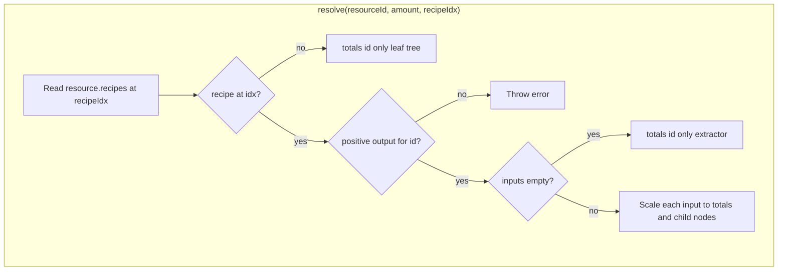

# Calculator

[← Technical hub](technical.md)

## Public API

- **[`calculate(resourceId, targetRate)`](../assets/js/calculator/service.ts)** — validates inputs, calls **`resolve`**, returns `{ resourceId, targetRate, totals, tree }` ([`CalculationResult`](../assets/js/contracts/index.ts)).
- **`totals`** — **per-minute** amounts for each **direct input** of the selected target recipe (scaled to `targetRate` output). No nested expansion into upstream recipes.
- **`tree`** — [`DependencyNode`](../assets/js/contracts/index.ts) for the dependency tree panel: root = target resource, children = those direct inputs (each child has no further children).

## Resolver

[`resolve` in `resolver.ts`](../assets/js/calculator/resolver.ts) applies **one** recipe step:

1. Loads [`resources[id]`](../assets/js/data/resources/index.ts) and picks **`resource.recipes[recipeIdx]`** (from the user’s **target recipe** index).
2. If there is **no recipe** for that resource (raw goods like ore), the node is a **leaf**: `totals` is `{ [id]: amount }` and the tree has no children.
3. If a recipe exists but **output quantity for `id` is missing or ≤ 0**, **`resolve` throws**.
4. If the recipe has **no inputs** (extractors, pumps), `totals` is `{ [id]: amount }` — the resource is counted as its own “requirement” line at the target rate.
5. Otherwise, for each recipe **input** `(inputId, inputAmount)`:
   - `rate = inputAmount * amount / produced` (same ratio as a single production step),
   - accumulate **`totals[inputId]`**,
   - add a **child** node `(inputId, rate)` with **no grandchildren**.

## Memoization

A **`Map`** caches `resolve` results by key `"${resourceId}|${amount}|${recipeIdx}"`. Call **`clearResolveCache()`** if resource definitions change at runtime (not used in normal SPA use).

## Net flow (related)

Surplus/deficit is **not** part of `calculate`; see [`calculateNet`](../assets/js/calculator/net.ts) and [UI and net flow](technical-ui-and-net.md).

## Related

- [Architecture](technical-architecture.md) — who calls `calculate`
- [Data and deployment](technical-data-and-deploy.md) — where `resources` and recipes come from
