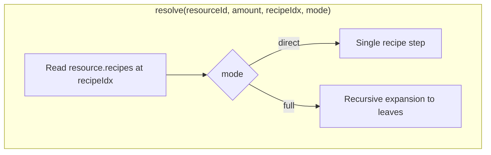

# Calculator

[← Technical hub](technical.md)

## Public API

- **[`calculate(resourceId, targetRate, targetRecipeIdx?, baseRequirementsMode?)`](../assets/js/calculator/service.ts)** — validates inputs, calls **`resolve`**, returns `{ resourceId, targetRate, totals, tree }` ([**`CalculationResult`**](../assets/js/contracts/index.ts)).
- **`targetRecipeIdx`** — index into **`ResourceDef.recipes`** for the target resource; must be a recipe that lists a positive **output** for that resource.
- **`baseRequirementsMode`** — **`direct`** (default) or **`full`** (see [Resolver](#resolver)).

In **`direct`** mode:

- **`totals`** — per-minute amounts for each **direct input** of the selected target recipe (scaled to **`targetRate`** output).
- **`tree`** — [`DependencyNode`](../assets/js/contracts/index.ts) for the dependency tree panel: root = target resource, children = those direct inputs (each child has no further children).

In **`full`** mode:

- **`totals`** — **leaf-only** requirements aggregated along the expanded chain (see **`resolve`** below).
- **`tree`** — expands through the default production recipe at each node (subject to cycle and depth limits).

## Resolver

[`resolve` in `resolver.ts`](../assets/js/calculator/resolver.ts) takes a **`ResolveMode`**: **`direct`** or **`full`**.

- **`direct`**: applies **one** recipe step (same structure as the historical single-step behavior).
- **`full`**: recursively expands using the first recipe that produces each resource, up to **`MAX_EXPANSION_PATH`** ancestors on a path, stopping at extractors, raw resources, cycles, or missing producers.

Direct-step behavior (simplified):

1. Loads [`resources[id]`](../assets/js/data/resources/index.ts) and picks **`resource.recipes[recipeIdx]`** (from the user’s **target recipe** index).
2. If there is **no recipe** for that resource (raw goods like ore), the node is a **leaf**: `totals` is `{ [id]: amount }` and the tree has no children.
3. If a recipe exists but **output quantity for `id` is missing or ≤ 0**, **`resolve` throws**.
4. If the recipe has **no inputs** (extractors, pumps), `totals` is `{ [id]: amount }` — the resource is counted as its own “requirement” line at the target rate.
5. Otherwise, for each recipe **input** `(inputId, inputAmount)` in **direct** mode: scale rates, accumulate **`totals[inputId]`**, add **child** nodes with **no grandchildren**.

## Memoization

A **`Map`** caches **`resolve`** results by key **`"${resourceId}|${amount}|${recipeIdx}|${mode}"`**. Call **`clearResolveCache()`** if resource definitions change at runtime (not used in normal SPA use).

## Net flow (related)

Surplus/deficit is **not** part of `calculate`; see [`calculateNet`](../assets/js/calculator/net.ts) and [UI and net flow](technical-ui-and-net.md).

## Related

- [Architecture](technical-architecture.md) — **`useCalculation`** and **`calculate`**
- [Data and deployment](technical-data-and-deploy.md) — where `resources` and recipes come from
