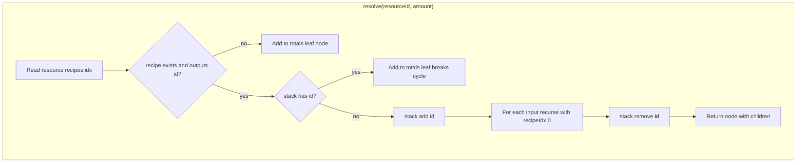

# Calculator

[← Technical hub](technical.md)

## Public API

- **[`calculate(resourceId, targetRate)`](../assets/js/calculator/service.ts)** — validates inputs, calls **`resolve`**, returns `{ resourceId, targetRate, totals, tree }` ([`CalculationResult`](../assets/js/contracts/index.ts)).
- **`totals`** — aggregated **per-minute** amounts for each resource visited while expanding the chain (see below).
- **`tree`** — nested [`DependencyNode`](../assets/js/contracts/index.ts) for the dependency tree panel.

## Resolver

[`resolve` in `resolver.ts`](../assets/js/calculator/resolver.ts) walks the recipe graph:

1. Loads [`resources[id]`](../assets/js/data/resources/index.ts) and picks **`resource.recipes[recipeIdx]`** (top-level call uses `recipeIdx = 0`).
2. If there is **no recipe**, or **output quantity for `id` is missing or non-positive**, the node is a **leaf**: add `amount` to `totals[id]` and return a node with no children.
3. Otherwise, for each recipe **input** `(inputId, inputAmount)` it recurses with  
   `childAmount = inputAmount * amount / produced`, **`recipeIdx` fixed to `0`** for nested calls (nested inputs always use each resource’s **first** recipe).

## Cycles in the game graph

The production graph can contain **feedback loops**. The resolver keeps a **`stack: Set<string>`** of resources currently being expanded. If **`stack` already contains `id`**, recursion stops: **`amount` is added to `totals[id]`** and a **leaf** node is returned (no children). This matches the comment in code: break cycles by treating revisits as leaves.

## Memoization

A **`Map`** caches `resolve` results by key `"${resourceId}|${amount}|${recipeIdx}"`. Call **`clearResolveCache()`** if resource definitions change at runtime (not used in normal SPA use).

## Net flow (related)

Surplus/deficit is **not** part of `calculate`; see [`calculateNet`](../assets/js/calculator/net.ts) and [UI and net flow](technical-ui-and-net.md).

## Related

- [Architecture](technical-architecture.md) — who calls `calculate`
- [Data and deployment](technical-data-and-deploy.md) — where `resources` and recipes come from
