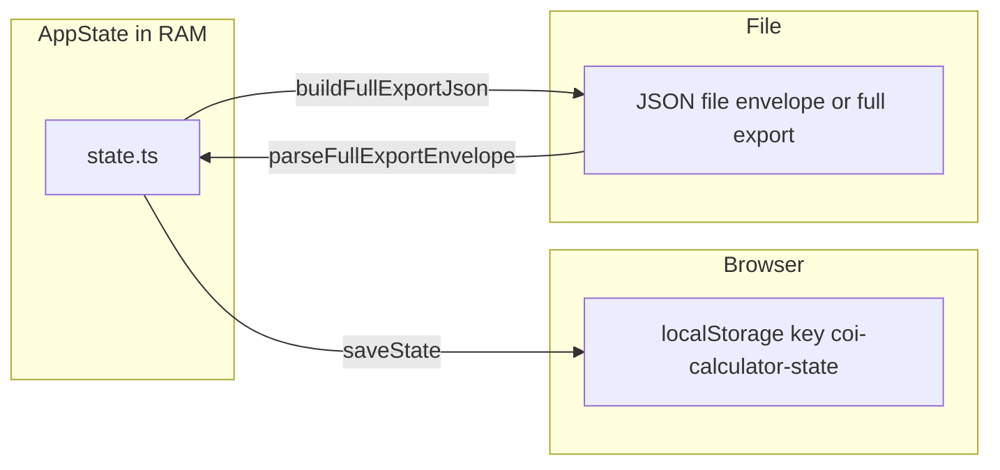

# State and persistence

[← Technical hub](technical.md)

## Types

Canonical definitions live in [`assets/js/contracts/index.ts`](../assets/js/contracts/index.ts):

- **`AppState`** — `resourceId`, `targetRate`, `targetRecipeIdx`, `baseRequirementsMode` (`direct` | `full`), `production`, `productionExtraIds`, `productionDismissedIds`, `productionPresets`, `resultsSections` (which results **`
`** panels are open: base / net / tree), `inputsSections` (which configuration **`
`** panels are open: **production** / **presets**), `netFlowChartStyle`, `userGuideExpanded`, `userGuideVisible`, `recentTargetResourceIds`
- **`PersistedEnvelope`** — `{ version, savedAt, data: AppState }`
- **`PersistedFullExportEnvelope`** — full backup format: `kind: 'coi-export'`, `formatVersion`, `savedAt`, nested **`app`** (`PersistedEnvelope`) and **`chrome`** (`PersistedChromeEnvelope`: `appView`, canvas workspace, sidebar, results sidebar, placement style — see [`contracts`](../assets/js/contracts/index.ts))

## In-memory state

[`assets/js/app/state.ts`](../assets/js/app/state.ts) holds the current `AppState`. Mutators validate (for example unknown resource ids are rejected) and call **`persist()`**, which serializes via [`saveState`](../assets/js/app/persistence.ts) to **`localStorage`**.

**`applyLoadedState`** (used after import or migration) merges with defaults, **sanitizes** against the current `resources` map (drops unknown ids), normalizes presets, `resultsSections`, and `inputsSections`, then persists.

## Storage key and versioning

- **Key:** `coi-calculator-state` (see [`persistence.ts`](../assets/js/app/persistence.ts)).
- **`STATE_VERSION`:** current envelope version is **12**; every write stamps `version` and `savedAt`.

Older stored JSON is **migrated** in **`migrateEnvelopeToAppState`** in [`persistence.ts`](../assets/js/app/persistence.ts). The exact steps between versions evolve with the product; read that function (and tests in [`tests/app/persistence.test.ts`](../tests/app/persistence.test.ts)) for the authoritative chain. If migration cannot reach the current version, load may clear storage and return null.

## Export and import

- **App-only export** — **`buildExportJson`** builds the same **`PersistedEnvelope`** shape as `localStorage` (pretty-printed JSON).
- **Full export** — **`buildFullExportJson`** builds a **`PersistedFullExportEnvelope`**: calculator state plus serialized **chrome** keys (current app view, canvas workspace, sidebar visibility, results sidebar width, placement style, etc.).
- **Import (header)** — [`parseFullExportEnvelope`](../assets/js/app/persistence.ts) accepts the **full** format (`kind: 'coi-export'`) or **legacy** app-only JSON; on success, applies loaded state and restores chrome when present.
- **`parsePersistedEnvelope`** — parses **AppState-only** JSON (no `kind`); used where only calculator data is needed.

## Reset

Clearing persisted data removes the key from `localStorage` and resets in-memory state to defaults — see **`wipeAllPersistedDataAndResetToDefaults`** in [`state.ts`](../assets/js/app/state.ts) and usage from [`AppHeader.tsx`](../src/components/layout/AppHeader.tsx).

## Related

- [Architecture](technical-architecture.md) — event flow and **`coiExternalStore`**
- [UI and net flow](technical-ui-and-net.md) — what `AppState` drives in the UI
- [Canvas](technical-canvas.md) — chrome keys and canvas storage
