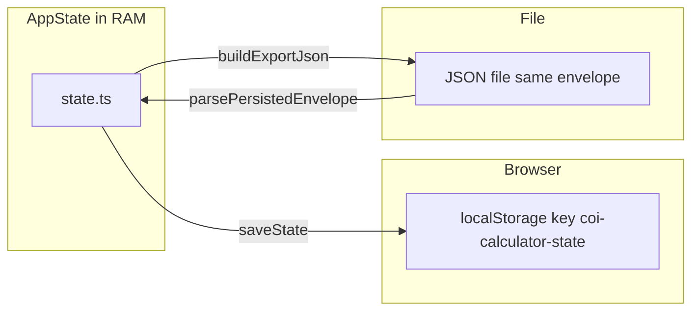

# State and persistence

[← Technical hub](technical.md)

## Types

Canonical definitions live in [`assets/js/contracts/index.ts`](../assets/js/contracts/index.ts):

- **`AppState`** — `resourceId`, `targetRate`, `production`, `productionExtraIds`, `productionDismissedIds`, `productionPresets`, `resultsSections` (which results `
` panels are open: base / net / tree), `inputsSections` (which configuration `
` panels are open: target / production / presets).
- **`PersistedEnvelope`** — `{ version, savedAt, data: AppState }`.

## In-memory state

[`assets/js/app/state.ts`](../assets/js/app/state.ts) holds the current `AppState`. Mutators validate (for example unknown resource ids are rejected) and call **`persist()`**, which serializes via [`saveState`](../assets/js/app/persistence.ts) to **`localStorage`**.

**`applyLoadedState`** (used after import or migration) merges with defaults, **sanitizes** against the current `resources` map (drops unknown ids), normalizes presets, `resultsSections`, and `inputsSections`, then persists.

## Storage key and versioning

- **Key:** `coi-calculator-state` (see [`persistence.ts`](../assets/js/app/persistence.ts)).
- **`STATE_VERSION`:** current envelope version is **5**; every write stamps `version` and `savedAt`.

Older stored JSON is **migrated** in `migrateEnvelopeToAppState` through versions **1 → 2 → 3 → 4 → 5**: **1→2** adds `productionExtraIds`, `resultsSections`, `inputsSections`, and related defaults; **2→3** adds `productionDismissedIds` and `productionPresets`; **3→4** normalizes `resultsSections`; **4→5** ensures `inputsSections` with defaults when absent. If migration cannot reach the current version, load may clear storage and return null.

## Export and import

- **Export** builds the **same envelope shape** as localStorage (pretty-printed JSON) via `buildExportJson`—suitable for a downloaded backup file.
- **Import** reads a file as text, passes it through **`parsePersistedEnvelope`** (no direct `localStorage` read), then **`applyLoadedState`** on success.

## Reset

Clearing persisted data removes the key from `localStorage` and resets in-memory state to defaults (see `wipeAllPersistedDataAndResetToDefaults` usage in [`events.ts`](../assets/js/ui/events.ts)).

## Related

- [Architecture](technical-architecture.md) — event flow and toolbar sync
- [UI and net flow](technical-ui-and-net.md) — what `AppState` drives in the UI
