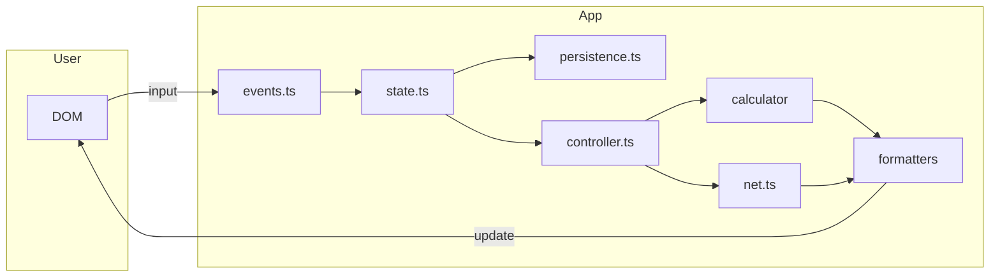

# Technical documentation

This project is a **static SPA**: **Vite** bundles **TypeScript**, the UI is **vanilla DOM** (no React/Vue), and **Vitest** covers calculators, persistence, and formatters. Source lives under `assets/js/` with HTML at the repo root (`index.html`).

Read the codebase top-down: [`main.ts`](../assets/js/main.ts) wires DOM elements, initializes state, binds events, and triggers the first render.

## End-to-end flow

## Topic guides

- **[Architecture](technical-architecture.md)** — modules, startup, event → persist → `updateResults`
- **[Calculator](technical-calculator.md)** — `resolve`, recipe expansion, cycles, caching
- **[State and persistence](technical-state-and-persistence.md)** — `AppState`, `PersistedEnvelope`, migrations, export/import
- **[UI and net flow](technical-ui-and-net.md)** — results rendering, production panel, net math
- **[Data and deployment](technical-data-and-deploy.md)** — resource data layout, wiki scripts, `VITE_BASE`, GitHub Pages

Shared TypeScript types: [`assets/js/contracts/index.ts`](../assets/js/contracts/index.ts).

Back to [documentation overview](README.md).
