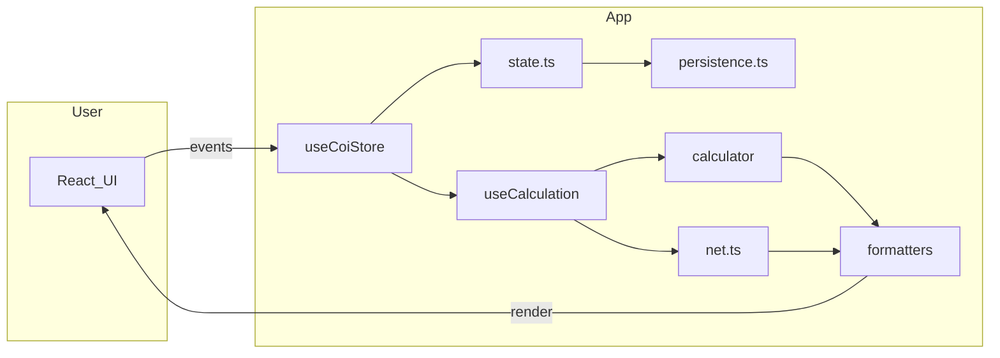

# Technical documentation

This project is a **static SPA**: **Vite** bundles **TypeScript** and **React**. Domain logic (calculator, persistence, resource data) lives under **`assets/js/`**; the UI lives under **`src/`**. **Vitest** covers calculators, persistence, formatters, and React utilities in **`tests/`**. The HTML entry is [`index.html`](../index.html) (mounts `#root`).

Read the codebase top-down: [`src/main.tsx`](../src/main.tsx) initializes analytics and the COI store, then renders [`App`](../src/App.tsx).

## End-to-end flow

## Topic guides

- **[Architecture](technical-architecture.md)** — modules, startup, React → state → calculation → views
- **[Calculator](technical-calculator.md)** — `calculate`, `resolve`, direct vs full mode, caching
- **[State and persistence](technical-state-and-persistence.md)** — `AppState`, `PersistedEnvelope`, migrations, export/import
- **[UI and net flow](technical-ui-and-net.md)** — results components, production panel, net math
- **[Data and deployment](technical-data-and-deploy.md)** — resource data layout, wiki scripts, `VITE_BASE`, GitHub Pages
- **[Canvas](technical-canvas.md)** — canvas workspace, placement, storage, and resolver usage

Shared TypeScript types: [`assets/js/contracts/index.ts`](../assets/js/contracts/index.ts).

Back to [documentation overview](README.md).
